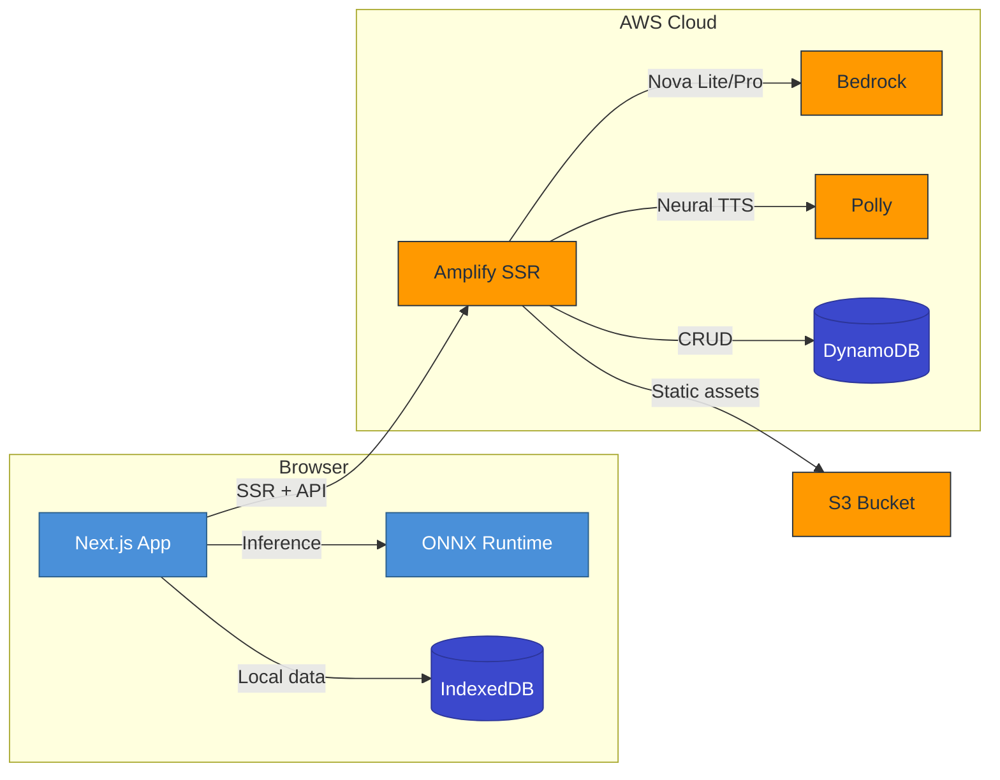
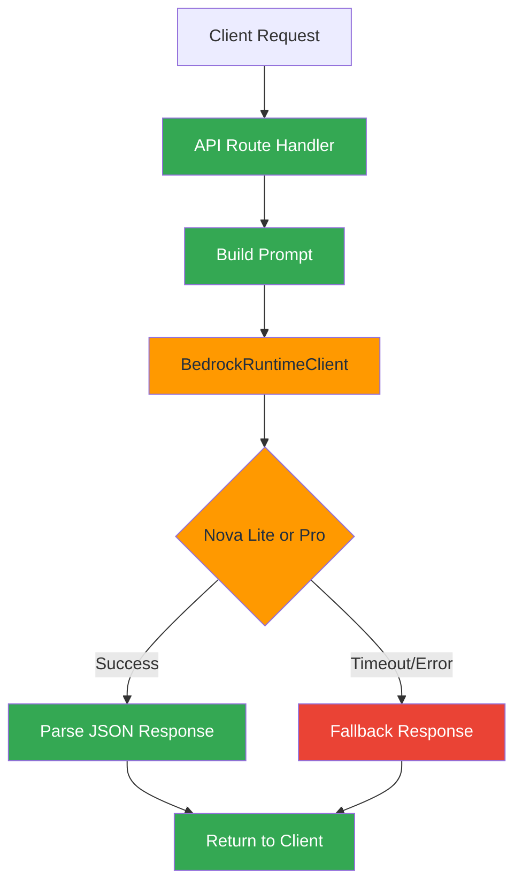
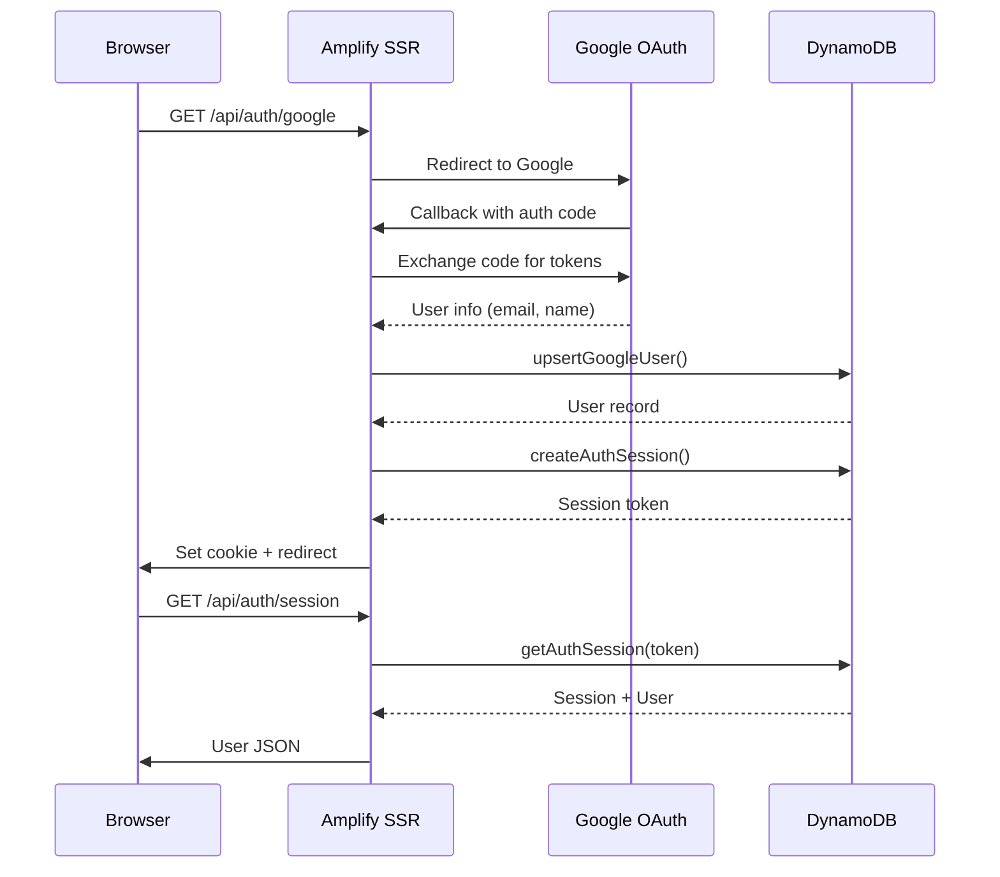
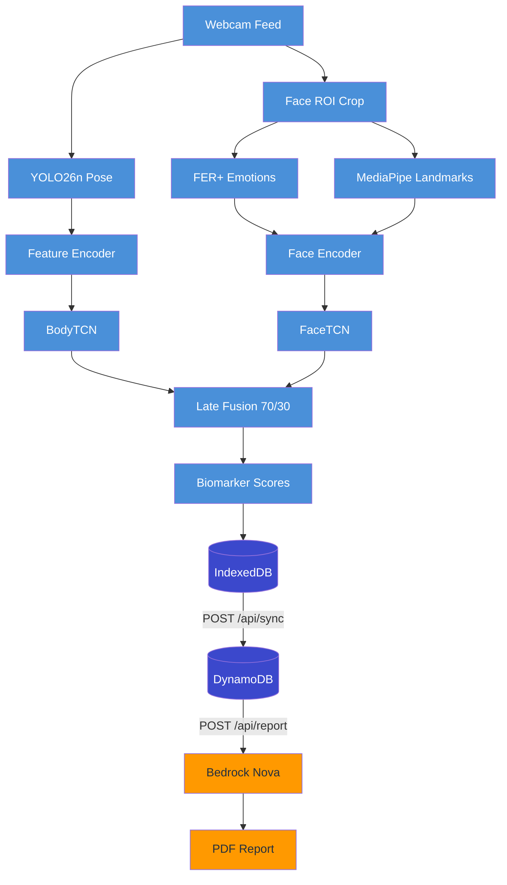

# Amazon Web Services — AutiSense Architecture

> Complete reference for all AWS services powering the AutiSense autism screening platform.
> Last updated: 2026-03-07

---

## Table of Contents

- [High-Level Architecture](#high-level-architecture)
- [Service Inventory](#service-inventory)
- [Amazon Bedrock (Generative AI)](#amazon-bedrock-generative-ai)
- [Amazon Polly (Text-to-Speech)](#amazon-polly-text-to-speech)
- [Amazon DynamoDB (Data Layer)](#amazon-dynamodb-data-layer)
- [AWS Amplify (Hosting & CI/CD)](#aws-amplify-hosting--cicd)
- [Amazon S3 (Object Storage)](#amazon-s3-object-storage)
- [AWS IAM (Access Control)](#aws-iam-access-control)
- [Credentials Strategy](#credentials-strategy)
- [API Route Matrix](#api-route-matrix)
- [Screening Data Flow](#screening-data-flow)
- [On-Device AI (No Cloud)](#on-device-ai-no-cloud)
- [Environment Variables](#environment-variables)
- [Cost & Budgets](#cost--budgets)

---

## High-Level Architecture



**Key principle**: The core screening AI (pose detection + behavior classification) runs **entirely on-device** via ONNX Runtime Web. AWS services handle generative AI enrichment, authentication, data sync, and hosting — all with graceful fallbacks so the app works even when cloud services are unavailable.

---

## Service Inventory

| # | Service | Resource | Region | Status | Cost Tier |
|---|---------|----------|--------|--------|-----------|
| 1 | **Amazon Bedrock** | Nova Lite v1 + Nova Pro v1 | us-east-1 | Active | Pay-per-token |
| 2 | **Amazon Polly** | Neural TTS (Joanna) | ap-south-1 | Active | Pay-per-char |
| 3 | **Amazon DynamoDB** | 7 tables (5 active, 2 placeholder) | ap-south-1 | Active | On-demand |
| 4 | **Amazon S3** | `autisense-models-762099405044` | ap-south-1 | Configured | Standard |
| 5 | **AWS Amplify** | WEB_COMPUTE SSR | ap-south-1 | Active | Build + hosting |
| 6 | **AWS IAM** | 1 user + 1 role + policies | Global | Active | Free |
| 7 | **AWS Budgets** | $10/month alarm | Global | Active | Free |

**Services NOT used**: EC2, ECS, API Gateway (Amplify handles routing internally), SageMaker, Kiro.

---

## Amazon Bedrock (Generative AI)

### Models

| Model ID | Model Name | Purpose | Routes | Inference Config |
|----------|-----------|---------|--------|-----------------|
| `amazon.nova-lite-v1:0` | Nova Lite | Chat, words, summary | 3 routes | maxTokens: 256-1024, temp: 0.7-0.8 |
| `amazon.nova-pro-v1:0` | Nova Pro | Clinical reports | 1 route | maxTokens: 512, temp: 0.5 |

Both models accessed via `BedrockRuntimeClient` + `InvokeModelCommand` from `@aws-sdk/client-bedrock-runtime`.

### Route Details

#### 1. AI Voice Conversation — `/api/chat/conversation`
- **File**: `app/api/chat/conversation/route.ts`
- **Model**: Nova Lite
- **Purpose**: Adaptive multi-turn conversation with child during screening (social, cognitive, language, motor domains)
- **Prompt**: System instructions embedded in first user message (Nova Lite has no system role). Multi-turn history maintained.
- **Response**: JSON extraction from markdown code blocks or raw text
- **Timeout**: 3-second AbortController on SDK call
- **Fallback**: Pre-defined conversation pool (greetings, mid-questions, farewells)

#### 2. Word/Sentence Generation — `/api/chat/generate-words`
- **File**: `app/api/chat/generate-words/route.ts`
- **Model**: Nova Lite
- **Purpose**: Generate age-appropriate vocabulary for speech tests
- **Modes**: `"words"` | `"sentences"` | `"instructions"`
- **Age Stratification**: Young (<36mo), Mid (36-60mo), Old (>60mo)
- **Timeout**: 3-second AbortController
- **Fallback**: Curated pools — 20 words per age bracket with emoji mappings

#### 3. Parent Summary — `/api/report/summary`
- **File**: `app/api/report/summary/route.ts`
- **Model**: Nova Lite
- **Purpose**: Translate biomarker scores to plain-language parent-friendly summary
- **Prompt**: Biomarker data + DSM-5 criteria mapping
- **Inference**: maxTokens=1024, temperature=0.7
- **Fallback**: Template-based mock summary

#### 4. Clinical Report — `/api/report/clinical`
- **File**: `app/api/report/clinical/route.ts`
- **Model**: Nova Pro (higher reasoning capability)
- **Purpose**: DSM-5 aligned clinical report with structured insights
- **Approach**: Hybrid — deterministic template generates ~85% of report, Nova Pro enriches with clinical depth
- **Template**: Maps biomarkers to Criterion A (social communication) and Criterion B (restricted behaviors)
- **Response**: Structured JSON (severityLevel, clinicalImpression, recommendations)
- **Inference**: maxTokens=512, temperature=0.5
- **Fallback**: Template-only report (no AI enrichment)

### Bedrock Data Flow



### Fallback Behavior

| Route | Trigger | Fallback Strategy |
|-------|---------|-------------------|
| `/api/chat/conversation` | Timeout (3s) or SDK error | Pre-defined conversation pool (greetings, mid-questions, farewells) |
| `/api/chat/generate-words` | Timeout (3s) or SDK error | Age-stratified curated word/sentence pools with emojis |
| `/api/report/summary` | Any Bedrock failure | Template mock summary with placeholder insights |
| `/api/report/clinical` | Any Bedrock failure | Deterministic template-only report (no AI enrichment) |

---

## Amazon Polly (Text-to-Speech)

| Setting | Value |
|---------|-------|
| **Route** | `POST /api/tts` |
| **File** | `app/api/tts/route.ts` |
| **SDK** | `PollyClient` + `SynthesizeSpeechCommand` |
| **Default Voice** | Joanna |
| **Engine** | Neural |
| **Output Format** | MP3 |
| **Max Text** | 3000 chars (truncated at 2900 at sentence boundary) |
| **Region** | `POLLY_REGION` env var or ap-south-1 |
| **Cache** | `Cache-Control: public, max-age=86400` |
| **Error** | Returns HTTP 503 |

**Client-side fallback**: When Polly fails, the client (`app/lib/tts/ttsHelper.ts`) falls back to browser `speechSynthesis` API with rate=0.8, pitch=1.1.

**Used by**: Word Echo challenge (Step 4), Speech Practice game, AI conversation voice playback.

---

## Amazon DynamoDB (Data Layer)

### Tables

| # | Table Name | PK | SK | GSI | TTL | Status | Purpose |
|---|-----------|----|----|-----|-----|--------|---------|
| 1 | `autisense-users` | `id` (S) | — | `email-index` (email → id) | — | Active | User accounts (Google OAuth) |
| 2 | `autisense-auth-sessions` | `token` (S) | — | — | `expiresAt` | Active | Session tokens (24h expiry) |
| 3 | `autisense-sessions` | `id` (S) | — | — | `ttl` (365d) | Active | Anonymized screening sessions |
| 4 | `autisense-biomarkers` | `sessionId` (S) | — | — | `ttl` (365d) | Active | Aggregated biomarker data |
| 5 | `autisense-feed-posts` | `postId` (S) | `createdAt` (N) | — | — | Active | Community feed posts + reactions |
| 6 | `autisense-child-profiles` | — | — | — | — | Placeholder | Future child profile storage |
| 7 | `autisense-session-summaries` | — | — | — | — | Placeholder | Future session summary cache |

### Authentication Flow



### Auth Library — `app/lib/auth/dynamodb.ts`

| Operation | DynamoDB Command | Table |
|-----------|-----------------|-------|
| `createUser()` | PutCommand | users |
| `getUserByEmail()` | QueryCommand (GSI) | users |
| `getUserById()` | GetCommand | users |
| `updateUser()` | UpdateCommand | users |
| `createAuthSession()` | PutCommand | auth-sessions |
| `getAuthSession()` | GetCommand + expiry check | auth-sessions |
| `deleteAuthSession()` | DeleteCommand | auth-sessions |
| `upsertGoogleUser()` | Query + conditional Put | users |

### Data Sync — `app/api/sync/route.ts`

| Field | Detail |
|-------|--------|
| **Trigger** | Client calls POST /api/sync after screening completes |
| **Data sent** | Anonymized session + aggregated biomarker scores |
| **PII protection** | `childName` stripped before write |
| **Idempotency** | `ConditionExpression: attribute_not_exists(id)` — duplicate writes silently succeed |
| **TTL** | 365 days from creation |
| **Tables** | `autisense-sessions` + `autisense-biomarkers` |

### Feed CRUD — `app/api/feed/route.ts`

| Method | Action | DynamoDB Command |
|--------|--------|-----------------|
| GET | List posts (filtered, sorted, limit 50-100) | ScanCommand |
| POST `action=create` | Create new post | PutCommand |
| POST `action=react` | Toggle reaction (heart/helpful/relate) | UpdateCommand |
| POST `action=delete` | Delete own post | DeleteCommand |

Reactions tracked per-user via `reactedBy` map — prevents double-reacting.

### Resilience: In-Memory Fallback

All DynamoDB operations in the auth library are wrapped with `withFallback()`:

1. **Primary**: DynamoDB call via SDK
2. **On failure**: Switch to in-memory `Map<>` storage
3. **Cooldown**: 30 seconds before retrying DynamoDB
4. **Scope**: Auth operations only (feed + sync fail with error)

---

## AWS Amplify (Hosting & CI/CD)

| Setting | Value |
|---------|-------|
| **Compute** | WEB_COMPUTE (SSR via Lambda) |
| **Region** | ap-south-1 (Mumbai) |
| **Framework** | Next.js 16 (auto-detected) |
| **Deploy** | Auto-deploy on push to `main` via GitHub webhook |
| **Node** | v20 (specified in amplify.yml) |
| **Build** | `npm ci` → `npm run build` |
| **Artifacts** | `.next/**/*` |
| **Cache** | `node_modules/**/*`, `.next/cache/**/*` |

### Build Configuration — `amplify.yml`

```yaml
version: 1
frontend:
  phases:
    preBuild:
      commands:
        - nvm use 20
        - npm ci
    build:
      commands:
        - npm run build
  artifacts:
    baseDirectory: .next
    files:
      - '**/*'
  cache:
    paths:
      - node_modules/**/*
      - .next/cache/**/*
```

**How it works**: Amplify builds the Next.js app, deploys static assets to CloudFront CDN, and runs SSR pages + API routes as Lambda functions behind an internal API Gateway. No explicit Lambda or API Gateway configuration needed — Amplify manages this automatically.

---

## Amazon S3 (Object Storage)

| Setting | Value |
|---------|-------|
| **Bucket** | `autisense-models-762099405044` |
| **Region** | ap-south-1 |
| **SDK** | Removed (`@aws-sdk/client-s3` and `@aws-sdk/s3-request-presigner` uninstalled — zero usage in code) |
| **Status** | Bucket exists for backup. **Not used at runtime** — models served from `public/` via CDN |

**Current approach**: ONNX models (YOLO26n, BodyTCN, FaceTCN, FER+) are served from `public/models/` as static assets via Amplify's CloudFront CDN. This is simpler and faster for the 4 small models (~5-15 MB each). S3 bucket exists as a future option for larger model storage or versioned model management.

---

## AWS IAM (Access Control)

| Resource | Type | Purpose |
|----------|------|---------|
| `autisense-app` | IAM User | Programmatic access for APP_* credentials |
| `AutiSenseAmplifyRole` | IAM Role | Amplify build + Lambda execution role |
| `AutiSenseBedrockPolicy` | IAM Policy | Allows `bedrock:InvokeModel` for Nova Lite + Nova Pro |
| Default chain | SDK Provider | Lambda runtime inherits role credentials automatically |

**Policy scope**: `AutiSenseBedrockPolicy` is scoped to `amazon.nova-lite-v1:0` and `amazon.nova-pro-v1:0` only. Cohere models removed from policy after migration to Nova.

---

## Credentials Strategy

### Dual-Provider Approach — `app/lib/aws/credentials.ts`

```
Priority 1: SDK default credential chain
  └─ Covers: Lambda IAM roles (Amplify), local dev with AWS_* env vars

Priority 2: Custom APP_* environment variables
  └─ Covers: Amplify deployments (AWS_* prefix is reserved/blocked by Amplify)
```

| Function | Returns | Used By |
|----------|---------|---------|
| `getAppCredentials()` | `{ accessKeyId, secretAccessKey }` from APP_* vars, or `undefined` | All Bedrock, Polly, DynamoDB clients |
| `getAppRegion(fallback)` | APP_REGION → AWS_REGION → fallback | All AWS SDK clients |

**Why APP_* instead of AWS_***: Amplify reserves the `AWS_*` environment variable prefix. Setting `AWS_ACCESS_KEY_ID` in Amplify console is blocked. The workaround uses `APP_ACCESS_KEY_ID` and `APP_SECRET_ACCESS_KEY` instead.

---

## API Route Matrix

| # | Route | Method | AWS Services | Fallback | File |
|---|-------|--------|-------------|----------|------|
| 1 | `/api/auth/google` | GET | None | — | `app/api/auth/google/route.ts` |
| 2 | `/api/auth/callback/google` | GET | DynamoDB | In-memory auth | `app/api/auth/callback/google/route.ts` |
| 3 | `/api/auth/session` | GET | DynamoDB | In-memory auth | `app/api/auth/session/route.ts` |
| 4 | `/api/auth/logout` | POST | DynamoDB | In-memory auth | `app/api/auth/logout/route.ts` |
| 5 | `/api/chat/conversation` | POST | Bedrock (Nova Lite) | Conversation pool | `app/api/chat/conversation/route.ts` |
| 6 | `/api/chat/generate-words` | POST | Bedrock (Nova Lite) | Curated word pools | `app/api/chat/generate-words/route.ts` |
| 7 | `/api/feed` | GET/POST | DynamoDB | In-memory (30s) | `app/api/feed/route.ts` |
| 8 | `/api/nearby` | POST | None (Overpass API) | — | `app/api/nearby/route.ts` |
| 9 | `/api/report/clinical` | POST | Bedrock (Nova Pro) | Template-only | `app/api/report/clinical/route.ts` |
| 10 | `/api/report/pdf` | POST | None (pdf-lib) | — | `app/api/report/pdf/route.ts` |
| 11 | `/api/report/summary` | POST | Bedrock (Nova Lite) | Mock summary | `app/api/report/summary/route.ts` |
| 12 | `/api/report/weekly` | POST | None (IndexedDB) | — | `app/api/report/weekly/route.ts` |
| 13 | `/api/sync` | POST | DynamoDB | Error response | `app/api/sync/route.ts` |
| 14 | `/api/tts` | POST | Polly | 503 (client uses speechSynthesis) | `app/api/tts/route.ts` |

**Summary**: 14 API routes total. 10 use AWS services (4 Bedrock, 1 Polly, 5 DynamoDB). 4 routes have no AWS dependency.

### Standalone Lambda Handler

| File | Purpose | AWS Services |
|------|---------|-------------|
| `server/lambda/sync-handler.ts` | Alternative async sync (API Gateway → Lambda) | DynamoDB (sessions + biomarkers) |

This handler is a direct Lambda function (not Next.js API route) that accepts `APIGatewayProxyEventV2` events. It mirrors `/api/sync` logic but runs independently. Currently available but not the primary sync path — the Next.js API route handles sync in the Amplify deployment.

---

## Screening Data Flow



**On-device** (blue): Everything from webcam capture through biomarker scoring runs in the browser via Web Workers + ONNX Runtime. Zero cloud dependency for core screening.

**Cloud** (orange): Only report generation uses AWS — biomarkers are synced to DynamoDB, then Bedrock enriches the clinical report. The screening works fully offline; cloud adds clinical depth.

---

## On-Device AI (No Cloud)

The core screening pipeline runs entirely in the browser using ONNX Runtime Web. No data leaves the device during inference.

### ONNX Models

| Model | File | Input | Output | Size |
|-------|------|-------|--------|------|
| YOLO26n-pose | `public/models/yolo26n-pose.onnx` | 320x240 RGB frame | 17 keypoints + confidence | ~5 MB |
| BodyTCN | `public/models/pose-tcn.onnx` | 86-dim feature sequence | 6 behavior classes | ~2 MB |
| FaceTCN | `public/models/face-tcn.onnx` | 64-dim feature sequence | 4 expression classes | ~1 MB |
| FER+ | `public/models/fer-plus.onnx` | 48x48 grayscale face | 8 emotion probabilities | ~8 MB |

### Behavior Classes

| Pipeline | Classes |
|----------|---------|
| **Body (6)** | hand_flapping, body_rocking, head_banging, spinning, toe_walking, non_autistic |
| **Face (4)** | typical_expression, flat_affect, atypical_expression, gaze_avoidance |

### Inference Architecture

| Component | File | Role |
|-----------|------|------|
| Web Worker | `workers/inference.worker.ts` | Off-main-thread ONNX inference |
| Feature Encoder | `app/lib/inference/FeatureEncoder.ts` | 86-dim body feature extraction from keypoints |
| Face Encoder | `app/lib/inference/FaceEncoder.ts` | 64-dim face feature extraction |
| Late Fusion | `app/lib/inference/fusionClassifier.ts` | 70% body + 30% face weighted merge |
| Action Detector | `app/lib/actions/actionDetector.ts` | Rule-based motor action verification |

**Privacy**: No video frames, keypoints, or inference results are ever transmitted to any server. All AI processing happens client-side.

---

## Environment Variables

### AWS-Related Variables

| Variable | Required | Default | Used By | Description |
|----------|----------|---------|---------|-------------|
| `APP_ACCESS_KEY_ID` | Yes (prod) | — | All AWS clients | IAM access key (Amplify-safe prefix) |
| `APP_SECRET_ACCESS_KEY` | Yes (prod) | — | All AWS clients | IAM secret key (Amplify-safe prefix) |
| `APP_REGION` | No | ap-south-1 | All AWS clients | Primary AWS region |
| `BEDROCK_REGION` | No | us-east-1 | Bedrock routes | Bedrock-specific region (Nova availability) |
| `POLLY_REGION` | No | ap-south-1 | TTS route | Polly-specific region |
| `S3_MODELS_BUCKET` | No | — | Not used at runtime | S3 bucket name (kept for future use) |

### DynamoDB Table Name Variables

| Variable | Default | Table |
|----------|---------|-------|
| `DYNAMODB_USERS_TABLE` | `autisense-users` | User accounts |
| `DYNAMODB_AUTH_SESSIONS_TABLE` | `autisense-auth-sessions` | Auth sessions |
| `DYNAMODB_SESSIONS_TABLE` | `autisense-sessions` | Screening sessions |
| `DYNAMODB_BIOMARKERS_TABLE` | `autisense-biomarkers` | Biomarker data |
| `DYNAMODB_FEED_POSTS_TABLE` | `autisense-feed-posts` | Community feed |
| `DYNAMODB_CHILD_PROFILES_TABLE` | `autisense-child-profiles` | (Placeholder) |
| `DYNAMODB_SESSION_SUMMARIES_TABLE` | `autisense-session-summaries` | (Placeholder) |

### Auth Variables

| Variable | Required | Description |
|----------|----------|-------------|
| `GOOGLE_CLIENT_ID` | Yes | Google OAuth client ID |
| `GOOGLE_CLIENT_SECRET` | Yes | Google OAuth client secret |
| `NEXT_PUBLIC_APP_URL` | Yes | Public app URL for OAuth redirect |

All variables are inlined at build time via `next.config.ts` `env` block.

---

## Cost & Budgets

### Budget Alarm

| Setting | Value |
|---------|-------|
| **Monthly limit** | $10 USD |
| **Alert threshold** | 80% ($8) |
| **Configured via** | AWS Budgets console |

### Cost-Saving Strategies

| Strategy | Impact |
|----------|--------|
| **On-device inference** | Core screening AI uses zero cloud compute |
| **Bedrock fallbacks** | App works fully without Bedrock (curated responses) |
| **DynamoDB on-demand** | Pay only for actual reads/writes, no provisioned capacity |
| **Polly caching** | 24h Cache-Control on TTS responses |
| **Nova Lite preference** | 3 of 4 Bedrock routes use cheaper Nova Lite; only clinical uses Pro |
| **Short max tokens** | 256-1024 tokens per request (not 4096) |
| **3s abort timeout** | Prevents runaway Bedrock calls |
| **365d TTL** | DynamoDB items auto-expire, preventing unbounded growth |

### Estimated Monthly Cost (Low Traffic)

| Service | Estimate |
|---------|----------|
| Amplify (build + hosting) | ~$0-2 |
| Bedrock (Nova Lite + Pro) | ~$0-3 (with fallbacks reducing calls) |
| Polly (Neural TTS) | ~$0-1 |
| DynamoDB (on-demand) | ~$0-1 |
| S3 | ~$0 (minimal storage) |
| **Total** | **~$1-7/month** |
